# Chat With Docs (RAG)
## Tech Stack
| Layer             | Choice                          | Rationale                           |
| ----------------- | ------------------------------- | ----------------------------------- |
| Vector store      | **pgvector (managed Supabase)** | 1-click, UK region, SQL familiarity |
| Embeddings & chat | Azure OpenAI - gpt-4o           | Enterprise SLA, GDPR-aligned        |
| API               | FastAPI                         | Async, quick setup                  |
| Front-end         | Next.js + shadcn/ui             | Rapid UI, SSR                       |
| Auth              | Clerk.dev free tier             | Offload security; JWT passthrough   |
| Hosting           | Fly.io UK or Railway            | Minutes to deploy, EU data          |

## Quick Start

### Prerequisites
- Python 3.11+
- Node.js 18+
- PostgreSQL with pgvector extension (or Supabase account)
- Azure OpenAI API access
- Clerk.dev account

### Backend Setup
```bash
cd backend
python -m venv venv
source venv/bin/activate  # On Windows: venv\Scripts\activate
pip install -r requirements.txt
cp .env.example .env
# Edit .env with your configuration
uvicorn app.main:app --reload
```

### Frontend Setup
```bash
cd frontend
npm install
cp .env.local.example .env.local
# Edit .env.local with your Clerk keys
npm run dev
```

### Development
Both servers should now be running:
- Backend API: http://localhost:8000
- Frontend: http://localhost:3000
- API docs: http://localhost:8000/docs

## Architecture

```mermaid
graph TB
    %% Styling
    classDef frontend fill:#3498db,stroke:#2980b9,stroke-width:2px,color:#fff
    classDef backend fill:#e74c3c,stroke:#c0392b,stroke-width:2px,color:#fff
    classDef database fill:#2ecc71,stroke:#27ae60,stroke-width:2px,color:#fff
    classDef external fill:#f39c12,stroke:#e67e22,stroke-width:2px,color:#fff
    classDef auth fill:#9b59b6,stroke:#8e44ad,stroke-width:2px,color:#fff
    
    %% User Layer
    User[👤 Legal Team<br/>Users]:::frontend
    
    %% Frontend Layer
    subgraph "Frontend (Next.js)"
        UI[🖥️ Next.js + shadcn/ui<br/>Chat Interface<br/>Document Upload]:::frontend
        Auth[🔐 Clerk.dev<br/>Authentication<br/>JWT Management]:::auth
    end
    
    %% Backend Layer  
    subgraph "Backend Services (FastAPI)"
        API[🚀 FastAPI Backend<br/>• Document Routes<br/>• Chat Routes<br/>• Auth Routes]:::backend
        
        subgraph "Core Services"
            Ingestion[📄 Document Processing<br/>• Parse PDFs<br/>• Text Chunking<br/>• Metadata Extraction]:::backend
            QnA[🤖 QnA Service<br/>• Query Processing<br/>• RAG Pipeline<br/>• Response Generation]:::backend
            Vector[🔍 Vector Store Utils<br/>• Similarity Search<br/>• Embedding Management]:::backend
        end
    end
    
    %% Database Layer
    subgraph "Data Storage (Supabase)"
        DB[(🗄️ PostgreSQL + pgvector<br/>• Documents Table<br/>• Chunks Table<br/>• Embeddings Table<br/>• Users Table<br/>• Vector Similarity Search)]:::database
    end
    
    %% External Services
    subgraph "AI Services (Azure OpenAI)"
        Embeddings[🧠 Text Embeddings<br/>Ada-002]:::external
        LLM[💬 GPT-4o<br/>Chat Completion<br/>Citation Generation]:::external
    end
    
    %% Additional Services
    Verification[✅ Claims Verification<br/>Fact Checking<br/>Source Validation]:::backend
    Hosting[☁️ Fly.io Hosting<br/>UK/EU Region<br/>GDPR Compliant]:::external
    
    %% Offline Indexing Pipeline
    User -->|Upload Documents| UI
    UI --> Auth
    Auth --> API
    API --> Ingestion
    Ingestion -->|Generate Embeddings| Embeddings
    Embeddings -->|Store Vectors| DB
    Ingestion -->|Store Metadata| DB
    
    %% Online Query Pipeline
    User -->|Ask Questions| UI
    UI -->|Authenticated Requests| API
    API --> QnA
    QnA --> Vector
    Vector -->|Semantic Search| DB
    DB -->|Retrieved Context| QnA
    QnA -->|Prompt + Context| LLM
    LLM -->|Generated Answer| Verification
    Verification -->|Verified Response| QnA
    QnA --> API
    API --> UI
    UI -->|Display Answer + Citations| User
    
    %% Infrastructure
    API -.->|Deployed on| Hosting
    DB -.->|Hosted in| Hosting
```


## Deployment

### Backend (Fly.io)
```bash
cd backend
fly launch
fly deploy
```

### Frontend (Vercel)
```bash
cd frontend
vercel
```

## Features
- 🔒 Secure authentication with Clerk
- 📄 Multi-format document upload (PDF, DOCX, TXT)
- 🔍 Semantic search with pgvector
- 💬 AI-powered Q&A with GPT-4o
- 📚 Automatic citation generation
- ✅ Source verification
- 🇪🇺 GDPR compliant hosting
