# Chat With Docs (RAG)
## Tech Stack
| Layer             | Choice                          | Rationale                           |
| ----------------- | ------------------------------- | ----------------------------------- |
| Vector store      | **pgvector (managed Supabase)** | 1-click, UK region, SQL familiarity |
| Embeddings & chat | Azure OpenAI - gpt-4o           | Enterprise SLA, GDPR-aligned        |
| API               | FastAPI                         | Async, quick setup                  |
| Front-end         | Next.js + shadcn/ui             | Rapid UI, SSR                       |
| Auth              | Clerk.dev free tier             | Offload security; JWT passthrough   |
| Hosting           | Fly.io UK or Railway            | Minutes to deploy, EU data          |

## Architecture

```mermaid
graph TB
    %% Styling
    classDef frontend fill:#3498db,stroke:#2980b9,stroke-width:2px,color:#fff
    classDef backend fill:#e74c3c,stroke:#c0392b,stroke-width:2px,color:#fff
    classDef database fill:#2ecc71,stroke:#27ae60,stroke-width:2px,color:#fff
    classDef external fill:#f39c12,stroke:#e67e22,stroke-width:2px,color:#fff
    classDef auth fill:#9b59b6,stroke:#8e44ad,stroke-width:2px,color:#fff
    
    %% User Layer
    User[👤 Legal Team<br/>Users]:::frontend
    
    %% Frontend Layer
    subgraph "Frontend (Next.js)"
        UI[🖥️ Next.js + shadcn/ui<br/>Chat Interface<br/>Document Upload]:::frontend
        Auth[🔐 Clerk.dev<br/>Authentication<br/>JWT Management]:::auth
    end
    
    %% Backend Layer  
    subgraph "Backend Services (FastAPI)"
        API[🚀 FastAPI Backend<br/>• Document Routes<br/>• Chat Routes<br/>• Auth Routes]:::backend
        
        subgraph "Core Services"
            Ingestion[📄 Document Processing<br/>• Parse PDFs<br/>• Text Chunking<br/>• Metadata Extraction]:::backend
            QnA[🤖 QnA Service<br/>• Query Processing<br/>• RAG Pipeline<br/>• Response Generation]:::backend
            Vector[🔍 Vector Store Utils<br/>• Similarity Search<br/>• Embedding Management]:::backend
        end
    end
    
    %% Database Layer
    subgraph "Data Storage (Supabase)"
        DB[(🗄️ PostgreSQL + pgvector<br/>• Documents Table<br/>• Chunks Table<br/>• Embeddings Table<br/>• Users Table<br/>• Vector Similarity Search)]:::database
    end
    
    %% External Services
    subgraph "AI Services (Azure OpenAI)"
        Embeddings[🧠 Text Embeddings<br/>Ada-002]:::external
        LLM[💬 GPT-4o<br/>Chat Completion<br/>Citation Generation]:::external
    end
    
    %% Additional Services
    Verification[✅ Claims Verification<br/>Fact Checking<br/>Source Validation]:::backend
    Hosting[☁️ Fly.io Hosting<br/>UK/EU Region<br/>GDPR Compliant]:::external
    
    %% Offline Indexing Pipeline
    User -->|Upload Documents| UI
    UI --> Auth
    Auth --> API
    API --> Ingestion
    Ingestion -->|Generate Embeddings| Embeddings
    Embeddings -->|Store Vectors| DB
    Ingestion -->|Store Metadata| DB
    
    %% Online Query Pipeline
    User -->|Ask Questions| UI
    UI -->|Authenticated Requests| API
    API --> QnA
    QnA --> Vector
    Vector -->|Semantic Search| DB
    DB -->|Retrieved Context| QnA
    QnA -->|Prompt + Context| LLM
    LLM -->|Generated Answer| Verification
    Verification -->|Verified Response| QnA
    QnA --> API
    API --> UI
    UI -->|Display Answer + Citations| User
    
    %% Infrastructure
    API -.->|Deployed on| Hosting
    DB -.->|Hosted in| Hosting
```

### RAG Architecture



### Architecture Overview

#### Offline Indexing Pipeline
1. **Document Upload**: Users upload legal documents through the Next.js frontend
2. **Processing**: FastAPI backend parses and chunks documents into manageable pieces
3. **Embedding**: Azure OpenAI generates vector embeddings for each chunk
4. **Storage**: Documents, chunks, and embeddings are stored in Supabase (PostgreSQL + pgvector)

#### Online Query Pipeline  
1. **User Query**: Legal team asks questions through the chat interface
2. **Retrieval**: System performs semantic search using pgvector to find relevant document chunks
3. **Generation**: Retrieved context is sent to GPT-4o for answer generation with citations
4. **Verification**: Optional claims verification step validates factual accuracy
5. **Response**: Answer with proper citations is returned to the user

#### Key Components

- **Frontend**: Next.js with shadcn/ui for rapid development and clean UI
- **Authentication**: Clerk.dev for user management and JWT-based security
- **Backend**: FastAPI for async operations and clean API design  
- **Database**: Supabase (PostgreSQL + pgvector) for unified data and vector storage
- **AI**: Azure OpenAI for enterprise-grade embeddings and chat completion
- **Hosting**: Fly.io with UK/EU deployment for GDPR compliance

#### Features
- 🔒 **Security**: JWT authentication with proper user isolation
- 📚 **Multi-document support**: Handle large legal document collections
- 🎯 **Accurate retrieval**: Semantic search with pgvector for relevant context
- 📖 **Source citations**: Automatic citation generation for transparency
- ✅ **Fact verification**: Optional claims checking against source documents
- 🇪🇺 **GDPR compliant**: UK/EU hosting with data deletion capabilities
- 🚀 **Scalable**: Modular design supporting multi-tenancy and feature extensions

## Suggested File Structures

A well-organized codebase will accelerate development. Below are the recommended file structures for the FastAPI backend and Next.js frontend, organized for clarity and future growth:

Backend (FastAPI) – A Python package app with clear submodules for routers, services, and models:
```
backend/
├── app/
│   ├── main.py               # FastAPI app initialization, route inclusion, CORS, etc.
│   ├── api/
│   │   ├── routes/
│   │   │   ├── auth.py       # Authentication endpoints (login, signup, token)
│   │   │   ├── documents.py  # File upload, list documents, delete document
│   │   │   └── chat.py       # Chat query endpoint (accepts question, returns answer)
│   │   └── dependencies.py   # Common dependencies (e.g. get_db session, auth checker)
│   ├── core/                 # Core logic and services
│   │   ├── ingestion.py      # Functions for parsing files, chunking, embedding
│   │   ├── qna.py            # Functions for retrieval and LLM query (RAG chain)
│   │   ├── vectorstore.py    # Utility to query or update the pgvector index
│   │   └── settings.py       # Config (API keys, DB connection, etc.)
│   ├── models/
│   │   ├── schemas.py        # Pydantic models for request/response (Document, Query, Answer)
│   │   └── database.py       # SQLAlchemy models or queries for Users, Documents, Chunks
│   ├── utils/
│   │   └── security.py       # Auth helpers (password hashing, JWT decoding)
│   └── tests/
│       ├── test_ingestion.py # Unit tests for document parsing & chunking
│       ├── test_qna.py       # Tests for retrieval+LLM pipeline (with mocked LLM)
│       └── test_api.py       # API endpoint tests (upload, query flows)
├── Dockerfile                # Container configuration for Fly.io deployment
├── requirements.txt          # Python dependencies (FastAPI, langchain, openai, etc.)
└── README.md                 # Developer setup and run instructions
```

Frontend (Next.js) – A TypeScript project bootstrapped with create-next-app, structured into pages and reusable components:
```
frontend/
├── pages/ or app/            # Next.js routes (using `pages` directory or `app` directory)
│   ├── index.tsx             # Landing page / login (if not authenticated, or intro)
│   ├── chat.tsx              # Protected page hosting the chat interface
│   └── upload.tsx            # Protected page for uploading and listing documents
├── components/
│   ├── Layout.tsx            # Common layout (header with app name, perhaps logout)
│   ├── DocumentList.tsx      # Shows uploaded documents and statuses
│   ├── UploadForm.tsx        # Drag-and-drop or file input component
│   ├── ChatWindow.tsx        # Main chat UI component (messages display + input box)
│   ├── MessageBubble.tsx     # Sub-component for a single message (question or answer with citations)
│   └── CitationViewer.tsx    # Component to show source snippet when citation is clicked
├── context/ or hooks/
│   └── AuthProvider.tsx      # Context provider for authentication state (JWT, user info)
├── lib/
│   ├── api.ts                # Wrapper functions for calling backend API (using fetch/Axios)
│   └── auth.ts               # Helpers for JWT management, e.g., storing token, redirect if unauth
├── styles/
│   └── globals.css           # Global styles or Tailwind CSS config if used
├── public/
│   └── ...                   # Static assets (e.g., logo)
├── next.config.js            # Next.js configuration (set API URLs, etc.)
├── package.json
└── README.md
```

Notes: We will use Next.js’s built-in routing for simplicity; the chat and upload pages will be behind authentication. After login, the user lands on upload (to add/view documents) and can navigate to chat to query their documents. We separate UI concerns: the chat interface is isolated in ChatWindow and can manage the conversational state (messages array). The CitationViewer might be a popover or modal that, given a citation reference (like a doc ID and page), fetches and displays the corresponding snippet or highlights it – this can be implemented in Week 3 or 4 once basic chat is working. Styling can use a component library or custom CSS; given the timeline, we might opt for a simple design or Tailwind CSS for speed.
