[](https://github.com/excetra-product-lab/chat_with_docs/actions/workflows/backend-ci.yml)
[](https://github.com/excetra-product-lab/chat_with_docs/actions/workflows/frontend-ci.yml)

# Chat With Docs (RAG)

## Tech Stack

| Layer             | Choice                          | Rationale                           |
| ----------------- | ------------------------------- | ----------------------------------- |
| Vector store      | **pgvector (managed Supabase)** | 1-click, UK region, SQL familiarity |
| Embeddings & chat | Azure OpenAI - gpt-4o/gpt-4.1   | Enterprise SLA, GDPR-aligned        |
| API               | FastAPI                         | Async, quick setup                  |
| Front-end         | Next.js + shadcn/ui             | Rapid UI, SSR                       |
| Auth              | Clerk.dev free tier             | Offload security; JWT passthrough   |
| Hosting           | Fly.io UK or Railway            | Minutes to deploy, EU data          |

## Quick Start

### Prerequisites

- Python 3.11+
- Node.js 18+
- PostgreSQL with pgvector extension (or Supabase account)
- Azure OpenAI API access
- Clerk.dev account

## Backend Setup

1. (Optional) Create & activate a venv:

   ```bash
   python -m venv venv
   source venv/bin/activate   # Windows: venv\Scripts\activate
   ```

2. Sync all dependencies using uv

   ```bash
   cd backend
   uv sync
   ```

3. **Install pre-commit hooks** (optional but recommended - prevents committing broken code):

   ```bash
   pre-commit install
   ```

   > 💡 **Tip**: Pre-commit hooks catch formatting/linting issues before you commit, saving you from CI failures.
   If you skip this step, CI will still catch issues, but you'll need to fix them in a separate commit.

4. Copy and customize the env files

   ```bash
   cp .env.test .env
   # Edit .env with database, Azure OpenAI, etc.
   ```

5. Start the dev server

   ```bash
   uv run uvicorn app.main:app --reload
   ```

### Frontend Setup

```bash
cd frontend
npm install
cp .env.local.example .env.local
# Edit .env.local with your Clerk keys
npm run dev
```

### Development

Both servers should now be running:

- Backend API: <http://localhost:8000>
- Frontend: <http://localhost:3000>
- API docs: <http://localhost:8000/docs>

## Architecture

```mermaid
graph TB
    %% Styling
    classDef frontend fill:#3498db,stroke:#2980b9,stroke-width:2px,color:#fff
    classDef backend fill:#e74c3c,stroke:#c0392b,stroke-width:2px,color:#fff
    classDef database fill:#2ecc71,stroke:#27ae60,stroke-width:2px,color:#fff
    classDef external fill:#f39c12,stroke:#e67e22,stroke-width:2px,color:#fff
    classDef auth fill:#9b59b6,stroke:#8e44ad,stroke-width:2px,color:#fff

    %% User Layer
    User[👤 Legal Team<br/>Users]:::frontend

    %% Frontend Layer
    subgraph "Frontend (Next.js)"
        UI[🖥️ Next.js + shadcn/ui<br/>Chat Interface<br/>Document Upload]:::frontend
        Auth[🔐 Clerk.dev<br/>Authentication<br/>JWT Management]:::auth
    end

    %% Backend Layer
    subgraph "Backend Services (FastAPI)"
        API[🚀 FastAPI Backend<br/>• Document Routes<br/>• Chat Routes<br/>• Auth Routes]:::backend

        subgraph "Core Services"
            Ingestion[📄 Document Processing<br/>• Parse PDFs<br/>• Text Chunking<br/>• Metadata Extraction]:::backend
            QnA[🤖 QnA Service<br/>• Query Processing<br/>• RAG Pipeline<br/>• Response Generation]:::backend
            Vector[🔍 Vector Store Utils<br/>• Similarity Search<br/>• Embedding Management]:::backend
        end
    end

    %% Database Layer
    subgraph "Data Storage (Supabase)"
        DB[(🗄️ PostgreSQL + pgvector<br/>• Documents Table<br/>• Chunks Table<br/>• Embeddings Table<br/>• Users Table<br/>• Vector Similarity Search)]:::database
    end

    %% External Services
    subgraph "AI Services (Azure OpenAI)"
        Embeddings[🧠 Text Embeddings<br/>Ada-002]:::external
        LLM[💬 GPT-4o/GPT-4.1<br/>Chat Completion]:::external
    end

    %% Additional Services
    Verification[✅ Claims Verification<br/>Fact Checking<br/>Source Validation]:::backend
    Hosting[☁️ Fly.io Hosting<br/>UK/EU Region<br/>GDPR Compliant]:::external

    %% Offline Indexing Pipeline
    User -->|Upload Documents| UI
    UI --> Auth
    Auth --> API
    API --> Ingestion
    Ingestion -->|Generate Embeddings| Embeddings
    Embeddings -->|Store Vectors| DB
    Ingestion -->|Store Metadata| DB

    %% Online Query Pipeline
    User -->|Ask Questions| UI
    UI -->|Authenticated Requests| API
    API --> QnA
    QnA --> Vector
    Vector -->|Semantic Search| DB
    DB -->|Retrieved Context| QnA
    QnA -->|Prompt + Context| LLM
    LLM -->|Generated Answer| Verification
    Verification -->|Verified Response| QnA
    QnA --> API
    API --> UI
    UI -->|Display Answer| User

    %% Infrastructure
    API -.->|Deployed on| Hosting
    DB -.->|Hosted in| Hosting
```



## Document Chunking Architecture

This system implements a sophisticated multi-tiered chunking architecture specifically designed for legal documents, ensuring optimal retrieval accuracy while preserving document structure and semantic relationships.

### Overview

The chunking system consists of three main layers:

1. **Basic Text Chunker** - Foundation layer handling all document types
2. **Hierarchical Chunker** - Advanced layer for legal documents with complex structure
3. **Document Structure Detection** - Intelligence layer that identifies document hierarchy


### 1. Basic Text Chunker (`TextChunker`)

The foundation layer that handles all document types with intelligent boundary detection:

**Key Features:**

- **Sentence-based splitting**: Uses regex patterns to split text at sentence boundaries
- **Size-based chunking**: Target chunk size of 1000 characters with 100 character overlap
- **Overlap strategy**: Intelligently preserves sentence boundaries in overlaps
- **Two operational modes**:
  - **Structured content mode**: Uses parsed document structure (headers, page numbers)
  - **Plain text mode**: Falls back to simple sentence-based chunking

**Processing Flow:**


### 2. Hierarchical Chunker (`HierarchicalChunker`)

The advanced layer designed specifically for legal documents with complex hierarchical structures.

**Core Algorithm (5-step process):**


**Key Innovation - Boundary Preservation:**
The hierarchical chunker ensures chunks never split important structural boundaries:

```python
# Example of boundary violation detection
def _find_boundary_violations(self, chunk_start: int, chunk_end: int, boundaries):
    """Find boundaries that are violated by a chunk's span."""
    violations = []

    for boundary in boundaries:
        boundary_pos = boundary["start_position"]

        # Check if boundary falls within chunk (but not at the start)
        if chunk_start < boundary_pos < chunk_end:
            # Only consider violations for important boundaries
            if (boundary["is_section_boundary"] or
                (boundary["is_subsection_boundary"] and boundary["hierarchy_level"] <= 2)):
                violations.append(boundary)

    return violations
```

### 3. Document Structure Detection System

Before hierarchy-aware chunking can occur, the system first analyzes and detects document structure:

```mermaid
graph TD
    A[Raw Text] --> B[StructureDetector]
    B --> C[HeadingDetector]
    B --> D[NumberingSystemHandler]
    B --> E[PatternHandler]

    C --> F[Detect Headings<br/>CHAPTER, ARTICLE, SECTION]
    D --> G[Parse Numbering<br/>1.2.3, §5, Article II]
    E --> H[Regex Patterns<br/>Legal document patterns]

    F --> I[DocumentElement Objects]
    G --> I
    H --> I

    I --> J[Build Hierarchy Tree]
    J --> K[DocumentStructure]

    K --> L[Elements with:<br/>- ElementType<br/>- Hierarchy Level<br/>- Position Info<br/>- Numbering System]

    style A fill:#ffebee
    style K fill:#e8f5e8
    style L fill:#e3f2fd
```



**Structure Detection Elements:**

- **ElementType**: `HEADING`, `SECTION`, `SUBSECTION`, `CLAUSE`, `PARAGRAPH`, `ARTICLE`, `CHAPTER`
- **NumberingType**: `DECIMAL` (1.2.3), `ROMAN_UPPER` (I, II), `SECTION_SYMBOL` (§), etc.
- **Hierarchy Levels**: 0=root, 1=section, 2=subsection, etc.

### 4. Token-Aware Optimization

The system uses token counting (not just character counting) for accurate chunk sizing:

```python
# Token-based length function
def _create_token_length_function(self):
    """Create a length function that counts tokens instead of characters."""
    def token_length(text: str) -> int:
        return self.token_counter.count_tokens(text)
    return token_length
```

**Chunk Size Optimization:**

- **Target range**: 400-800 tokens (configurable)
- **Minimum**: 100 tokens
- **Maximum**: 1024 tokens (forced split)
- **Overlap**: 100 tokens with intelligent boundary preservation

### Document Type Handling

Different document types are processed through specialized pipelines:


### Integration with LangChain Pipeline

The `DocumentPipeline` orchestrates the entire process:

1. **Loading**: Different loaders for PDF, Word, text files
2. **Transformation**: Clean HTML, normalize text
3. **Splitting**: Choose between strategies:
   - `"recursive"`: RecursiveCharacterTextSplitter
   - `"character"`: CharacterTextSplitter
   - `"semantic"`: Semantic-based splitting
   - `"hierarchical"`: Custom hierarchical chunker

### Real-World Example

For a legal contract with sections like:

```text
ARTICLE I - DEFINITIONS
1.1 "Agreement" means...
1.2 "Party" means...

ARTICLE II - OBLIGATIONS
2.1 The Vendor shall...
2.2 The Client shall...
```

**Hierarchical Chunker produces:**

- **Chunk 1**: "ARTICLE I - DEFINITIONS\n1.1 'Agreement' means..."
  - `hierarchy_level`: 1
  - `element_type`: ARTICLE
  - `numbering`: "I"
  - `section_title`: "DEFINITIONS"

- **Chunk 2**: "1.2 'Party' means..."
  - `hierarchy_level`: 2
  - `element_type`: SUBSECTION
  - `numbering`: "1.2"
  - `parent_elements`: ["I"]

This preserves the legal document structure while creating optimal chunks for RAG retrieval, ensuring that related content stays together and hierarchical context is maintained for better search and Q&A accuracy.

The system is designed specifically for legal documents but gracefully falls back to simpler strategies for other document types, making it robust and versatile.

## Deployment

### Backend (Fly.io)

```bash
cd backend
fly launch
fly deploy
```

### Frontend (Vercel)

```bash
cd frontend
vercel
```

## Features

- 🔒 Secure authentication with Clerk
- 📄 Multi-format document upload (PDF, DOCX, TXT)
- 🔍 Semantic search with pgvector
- 💬 AI-powered Q&A with GPT-4o/GPT-4.1
- 📚 Document-aware responses
- ✅ Source verification
- 🇪🇺 GDPR compliant hosting
