[](https://github.com/excetra-product-lab/chat_with_docs/actions/workflows/backend-ci.yml)
[](https://github.com/excetra-product-lab/chat_with_docs/actions/workflows/frontend-ci.yml)

# Chat With Docs (RAG)

A sophisticated RAG (Retrieval-Augmented Generation) system designed specifically for legal documents, featuring intelligent hierarchical chunking, semantic search, and AI-powered Q&A capabilities.

## 📋 Table of Contents

- [Tech Stack](#tech-stack)
- [Quick Start](#quick-start)
- [Architecture](#architecture)
- [Document Chunking Architecture](#document-chunking-architecture)
- [Deployment](#deployment)
- [Features](#features)

## Tech Stack

| Layer             | Choice                          | Rationale                           |
| ----------------- | ------------------------------- | ----------------------------------- |
| 🗄️ Vector store      | **pgvector (managed Supabase)** | 1-click, UK region, SQL familiarity |
| 🧠 Embeddings & chat | Azure OpenAI - gpt-4o/gpt-4.1   | Enterprise SLA, GDPR-aligned        |
| 🚀 API               | FastAPI                         | Async, quick setup                  |
| 🖥️ Front-end         | Next.js + shadcn/ui             | Rapid UI, SSR                       |
| 🔐 Auth              | Clerk.dev free tier             | Offload security; JWT passthrough   |
| ☁️ Hosting           | Fly.io UK or Railway            | Minutes to deploy, EU data          |

## Quick Start

### Prerequisites

- 🐍 Python 3.11+
- 📦 Node.js 18+
- 🗄️ PostgreSQL with pgvector extension (or Supabase account)
- 🧠 Azure OpenAI API access
- 🔐 Clerk.dev account

## 🔧 Backend Setup

1. **(Optional) Create & activate a venv:**

   ```bash
   python -m venv venv
   source venv/bin/activate   # Windows: venv\Scripts\activate
   ```

2. **Sync all dependencies using uv**

   ```bash
   cd backend
   uv sync
   ```

3. **Install pre-commit hooks** (optional but recommended - prevents committing broken code):

   ```bash
   pre-commit install
   ```

   > 💡 **Tip**: Pre-commit hooks catch formatting/linting issues before you commit, saving you from CI failures.
   If you skip this step, CI will still catch issues, but you'll need to fix them in a separate commit.

4. **Copy and customize the env files**

   ```bash
   cp .env.example .env
   # Edit .env with database, Azure OpenAI, etc.
   ```

5. **Start the dev server**

   ```bash
   uv run uvicorn app.main:app --reload
   ```

### 🖥️ Frontend Setup

1. **Navigate to the frontend directory and install dependencies:**

   ```bash
   cd frontend
   npm install
   ```

2. **Copy and customize the environment file:**

   ```bash
   cp .env.local.example .env.local
   # Edit .env.local with your Clerk keys
   ```

3. **Start the development server:**

   ```bash
   npm run dev
   ```

### 🚀 Development

Both servers should now be running:

- 🚀 **Backend API**: <http://localhost:8000>
- 🖥️ **Frontend**: <http://localhost:3000>
- 📚 **API docs**: <http://localhost:8000/docs>

## Architecture

```mermaid
graph TB
    %% Styling
    classDef frontend fill:#3498db,stroke:#2980b9,stroke-width:2px,color:#fff
    classDef backend fill:#e74c3c,stroke:#c0392b,stroke-width:2px,color:#fff
    classDef database fill:#2ecc71,stroke:#27ae60,stroke-width:2px,color:#fff
    classDef external fill:#f39c12,stroke:#e67e22,stroke-width:2px,color:#fff
    classDef auth fill:#9b59b6,stroke:#8e44ad,stroke-width:2px,color:#fff

    %% User Layer
    User[👤 Legal Team<br/>Users]:::frontend

    %% Frontend Layer
    subgraph "Frontend (Next.js)"
        UI[🖥️ Next.js + shadcn/ui<br/>Chat Interface<br/>Document Upload]:::frontend
        Auth[🔐 Clerk.dev<br/>Authentication<br/>JWT Management]:::auth
    end

    %% Backend Layer
    subgraph "Backend Services (FastAPI)"
        API[🚀 FastAPI Backend<br/>• Document Routes<br/>• Chat Routes<br/>• Auth Routes]:::backend

        subgraph "Core Services"
            Ingestion[📄 Document Processing<br/>• Parse PDFs<br/>• Text Chunking<br/>• Metadata Extraction]:::backend
            QnA[🤖 QnA Service<br/>• Query Processing<br/>• RAG Pipeline<br/>• Response Generation]:::backend
            Vector[🔍 Vector Store Utils<br/>• Similarity Search<br/>• Embedding Management]:::backend
        end
    end

    %% Database Layer
    subgraph "Data Storage (Supabase)"
        DB[(🗄️ PostgreSQL + pgvector<br/>• Documents Table<br/>• Chunks Table<br/>• Embeddings Table<br/>• Users Table<br/>• Vector Similarity Search)]:::database
    end

    %% External Services
    subgraph "AI Services (Azure OpenAI)"
        Embeddings[🧠 Text Embeddings<br/>Ada-002]:::external
        LLM[💬 GPT-4o/GPT-4.1<br/>Chat Completion]:::external
    end

    %% Additional Services
    Verification[✅ Claims Verification<br/>Fact Checking<br/>Source Validation]:::backend
    Hosting[☁️ Fly.io Hosting<br/>UK/EU Region<br/>GDPR Compliant]:::external

    %% Offline Indexing Pipeline
    User -->|Upload Documents| UI
    UI --> Auth
    Auth --> API
    API --> Ingestion
    Ingestion -->|Generate Embeddings| Embeddings
    Embeddings -->|Store Vectors| DB
    Ingestion -->|Store Metadata| DB

    %% Online Query Pipeline
    User -->|Ask Questions| UI
    UI -->|Authenticated Requests| API
    API --> QnA
    QnA --> Vector
    Vector -->|Semantic Search| DB
    DB -->|Retrieved Context| QnA
    QnA -->|Prompt + Context| LLM
    LLM -->|Generated Answer| Verification
    Verification -->|Verified Response| QnA
    QnA --> API
    API --> UI
    UI -->|Display Answer| User

    %% Infrastructure
    API -.->|Deployed on| Hosting
    DB -.->|Hosted in| Hosting
```



## Document Chunking Architecture

This system implements a sophisticated multi-tiered chunking architecture specifically designed for legal documents, ensuring optimal retrieval accuracy while preserving document structure and semantic relationships.

### Overview

The chunking system consists of three main layers:

1. **📝 Basic Text Chunker** - Foundation layer handling all document types
2. **⚡ Hierarchical Chunker** - Advanced layer for legal documents with complex structure
3. **🔍 Document Structure Detection** - Intelligence layer that identifies document hierarchy

```mermaid
graph TD
    A[📄 Document Input] --> B{🔍 Document Type Check}
    B -->|PDF/DOC/TXT| C[📖 Document Loading]
    C --> D[🔧 Document Parsing]
    D --> E{🏗️ Structure Available?}
    E -->|Yes| F[🏛️ Structured Content Chunking]
    E -->|No| G[📝 Plain Text Chunking]
    F --> H[🔗 TextChunker with Structure]
    G --> I[📝 TextChunker Basic]
    H --> J[⚡ Hierarchical Chunker<br/>Optional Advanced]
    I --> J
    J --> K[🎯 Chunk Optimization]
    K --> L[📦 Final Document Chunks]

    style A fill:#e1f5fe
    style L fill:#c8e6c9
    style J fill:#fff3e0
```



### How Chunking Works: A Concrete Example

Let's follow a real legal document through the entire chunking process:

#### Example Document: Employment Contract

```text
EMPLOYMENT AGREEMENT

ARTICLE I - DEFINITIONS
1.1 "Employee" means John Smith, residing at 123 Main Street.
1.2 "Company" means TechCorp Inc., a Delaware corporation.
1.3 "Effective Date" means January 1, 2024.

ARTICLE II - POSITION AND DUTIES
2.1 The Employee shall serve as Senior Software Engineer.
2.2 The Employee shall report directly to the CTO.
2.3 The Employee shall perform all duties assigned by the Company.

ARTICLE III - COMPENSATION
3.1 Base Salary: $120,000 per year, paid bi-weekly.
3.2 Benefits: Health, dental, and 401(k) matching.
3.3 Bonus: Up to 20% of base salary based on performance.
```

#### Stage 1: Document Structure Detection

The system first analyzes the document to identify its hierarchical structure:


#### Stage 2: Hierarchical Chunking Process

The system now creates chunks while preserving document structure:

```mermaid
graph LR
    subgraph "Chunk 1: Article I"
        A1[📋 ARTICLE I - DEFINITIONS\n1.1 "Employee" means John Smith...\n1.2 "Company" means TechCorp Inc...\n1.3 "Effective Date" means...]
        A2[🏷️ Metadata:\n• hierarchy_level: 1\n• element_type: ARTICLE\n• numbering: "I"\n• section_title: "DEFINITIONS"]
    end

    subgraph "Chunk 2: Article II"
        B1[📋 ARTICLE II - POSITION AND DUTIES\n2.1 The Employee shall serve...\n2.2 The Employee shall report...\n2.3 The Employee shall perform...]
        B2[🏷️ Metadata:\n• hierarchy_level: 1\n• element_type: ARTICLE\n• numbering: "II"\n• section_title: "POSITION AND DUTIES"]
    end

    subgraph "Chunk 3: Article III"
        C1[📋 ARTICLE III - COMPENSATION\n3.1 Base Salary: $120,000...\n3.2 Benefits: Health, dental...\n3.3 Bonus: Up to 20%...]
        C2[🏷️ Metadata:\n• hierarchy_level: 1\n• element_type: ARTICLE\n• numbering: "III"\n• section_title: "COMPENSATION"]
    end

    style A1 fill:#e3f2fd
    style B1 fill:#fff3e0
    style C1 fill:#f3e5f5
```

#### Stage 3: Chunk Optimization

The system ensures each chunk meets size requirements while maintaining structure:

```mermaid
graph TD
    A[📦 Initial Chunks] --> B[📏 Size Check]
    B --> C{Chunk Size OK?}
    C -->|Yes| D[✅ Keep Chunk]
    C -->|Too Large| E[✂️ Split at Boundaries]
    C -->|Too Small| F[🔗 Merge with Adjacent]

    E --> G[🔍 Find Safe Split Points]
    G --> H[📋 Split at Section Boundaries]
    H --> I[📦 New Optimized Chunks]

    F --> J[🔗 Combine Small Chunks]
    J --> K[📦 Merged Chunks]

    D --> L[📊 Final Chunk Collection]
    I --> L
    K --> L

    style A fill:#e1f5fe
    style L fill:#c8e6c9
    style E fill:#ffebee
    style F fill:#fff3e0
```



### Key Benefits of This Approach

#### 1. **🏗️ Structure Preservation**

- Legal sections stay together
- Hierarchical relationships maintained
- Numbering systems preserved

#### 2. **🎯 Optimal Retrieval**

- Related content in same chunk
- Context-aware search results
- Better RAG performance

#### 3. **🔄 Flexible Fallback**

- Works with any document type
- Gracefully degrades for simple docs
- Maintains quality across formats

### Technical Implementation

#### 📝 Basic Text Chunker Features

- **Sentence-based splitting**: Uses regex patterns for natural boundaries
- **Size-based chunking**: Target 1000 characters with 100 character overlap
- **Overlap strategy**: Preserves sentence boundaries in overlaps

#### ⚡ Hierarchical Chunker Algorithm

```mermaid
graph LR
    subgraph "5-Step Process"
        A[1️⃣ Structure Detection] --> B[2️⃣ Dynamic Separators]
        B --> C[3️⃣ Boundary Extraction]
        C --> D[4️⃣ Boundary-Aware Splitting]
        D --> E[5️⃣ Metadata Enrichment]
    end

    A --> A1[🔍 Detect headings & numbering]
    B --> B1[⚙️ Generate legal separators]
    C --> C1[📍 Mark section boundaries]
    D --> D1[✂️ Split at safe points]
    E --> E1[🏷️ Add hierarchy metadata]

    style A fill:#e3f2fd
    style E fill:#c8e6c9
```



#### 🚫 Boundary Violation Prevention

The system ensures chunks never split important structural boundaries:

```python
# Example: Boundary violation detection
def _find_boundary_violations(self, chunk_start: int, chunk_end: int, boundaries):
    """Find boundaries that are violated by a chunk's span."""
    violations = []

    for boundary in boundaries:
        boundary_pos = boundary["start_position"]

        # Check if boundary falls within chunk (but not at the start)
        if chunk_start < boundary_pos < chunk_end:
            # Only consider violations for important boundaries
            if (boundary["is_section_boundary"] or
                (boundary["is_subsection_boundary"] and boundary["hierarchy_level"] <= 2)):
                violations.append(boundary)

    return violations
```

### 📄 Document Type Handling

Different document types are processed through specialized pipelines:

```mermaid
graph TD
    subgraph "Legal Documents (PDF/DOCX)"
        A1[📋 Contract.pdf] --> A2[🔍 Extract Structure]
        A2 --> A3[⚡ HierarchicalChunker]
        A3 --> A4[📦 Section-aware chunks<br/>with numbering & metadata]
    end

    subgraph "Simple Documents (TXT)"
        B1[📝 Report.txt] --> B2[📖 Basic Parsing]
        B2 --> B3[📝 TextChunker]
        B3 --> B4[📦 Sentence-based chunks]
    end

    subgraph "Mixed Documents (DOCX)"
        C1[📄 Manual.docx] --> C2[🏗️ Structured Content]
        C2 --> C3[🔗 TextChunker Structured]
        C3 --> C4[📦 Header-aware chunks<br/>with page numbers]
    end

    A4 --> D[🗄️ Vector Store]
    B4 --> D
    C4 --> D

    style A3 fill:#fff3e0
    style B3 fill:#e3f2fd
    style C3 fill:#f3e5f5
    style D fill:#c8e6c9
```



### 🔗 Integration with LangChain Pipeline

The `DocumentPipeline` orchestrates the entire process:

1. **📥 Loading**: Different loaders for PDF, Word, text files
2. **🔄 Transformation**: Clean HTML, normalize text
3. **✂️ Splitting**: Choose between strategies:
   - `"recursive"`: RecursiveCharacterTextSplitter
   - `"character"`: CharacterTextSplitter
   - `"semantic"`: Semantic-based splitting
   - `"hierarchical"`: Custom hierarchical chunker

### 🎯 Why This Matters for RAG

#### ❌ Before (Simple Chunking):

```text
Chunk 1: "ARTICLE I - DEFINITIONS 1.1 'Employee' means John Smith..."
Chunk 2: "residing at 123 Main Street. 1.2 'Company' means TechCorp Inc..."
Chunk 3: "a Delaware corporation. 1.3 'Effective Date' means January 1..."
```

**Problems:**

- ❌ Definitions split across chunks
- ❌ Context lost between related items
- ❌ Poor search relevance

#### After (Hierarchical Chunking):

```text
Chunk 1: "ARTICLE I - DEFINITIONS\n1.1 'Employee' means John Smith, residing at 123 Main Street.\n1.2 'Company' means TechCorp Inc., a Delaware corporation.\n1.3 'Effective Date' means January 1, 2024."
```

**Benefits:**

- ✅ Complete definitions in single chunks
- ✅ Context preserved
- ✅ Better search accuracy
- ✅ Hierarchical metadata for filtering

This chunking strategy ensures that when users ask questions like "What are the employee's duties?" or "What is the compensation structure?", the RAG system can retrieve complete, contextually relevant sections rather than fragmented pieces of information.

### 🧮 Token-Aware Optimization

The system uses token counting (not just character counting) for accurate chunk sizing:

```python
# Token-based length function
def _create_token_length_function(self):
    """Create a length function that counts tokens instead of characters."""
    def token_length(text: str) -> int:
        return self.token_counter.count_tokens(text)
    return token_length
```

**Chunk Size Optimization:**

- **Target range**: 400-800 tokens (configurable)
- **Minimum**: 100 tokens
- **Maximum**: 1024 tokens (forced split)
- **Overlap**: 100 tokens with intelligent boundary preservation

### 🔍 Document Structure Detection Elements

The system identifies and tracks various document elements:

- **ElementType**: `HEADING`, `SECTION`, `SUBSECTION`, `CLAUSE`, `PARAGRAPH`, `ARTICLE`, `CHAPTER`
- **NumberingType**: `DECIMAL` (1.2.3), `ROMAN_UPPER` (I, II), `SECTION_SYMBOL` (§), etc.
- **Hierarchy Levels**: 0=root, 1=section, 2=subsection, etc.

The system is designed specifically for legal documents but gracefully falls back to simpler strategies for other document types, making it robust and versatile.

## Deployment

### Backend (Fly.io)

```bash
cd backend
fly launch
fly deploy
```

### Frontend (Vercel)

```bash
cd frontend
vercel
```

## Features

- 🔒 Secure authentication with Clerk
- 📄 Multi-format document upload (PDF, DOCX, TXT)
- 🔍 Semantic search with pgvector
- 💬 AI-powered Q&A with GPT-4o/GPT-4.1
- 📚 Document-aware responses
- ✅ Source verification
- 🇪🇺 GDPR compliant hosting
